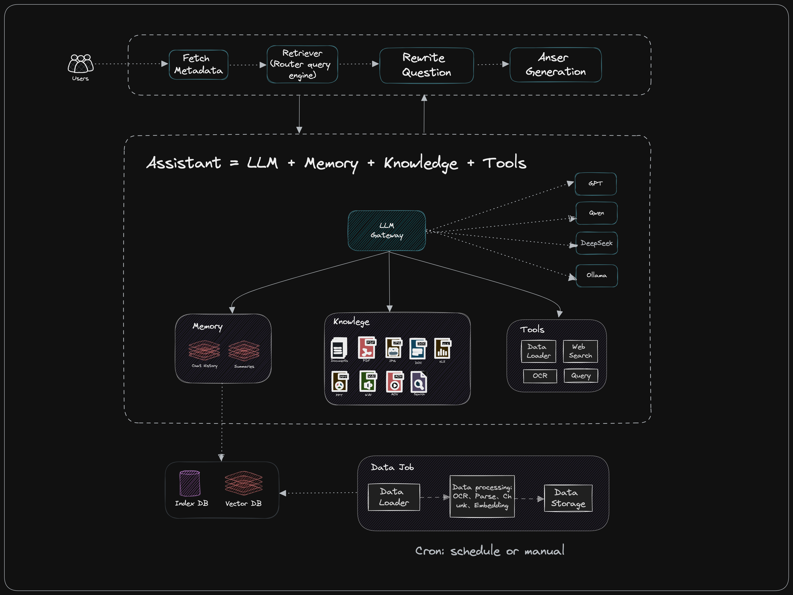

# superforu-ai-engine
***
## 生产级AI数据引擎  
通过AI数据引擎，快速构建高性能可持续的AI应用，如：RGA应用、客服机器人、写作助手、阅读助手、合同助手、论文助手等。 
系统提供全面的API服务，外部应用可快速集成AI能力，如: 知识库、OCR、Embedding、Chat服务。

在线应用案例: http://www.superforu.com

⚠️ 系统代码正在持续迭代上传中  

## 系统架构
新架构解决RAG无法精准提取内容、上下文过大、问题模糊、长期记忆等问题



## 功能一览
- 知识管理：通过可视化管理知识并记录知识处理状态
- Agent: 自定义Agent
- LLM对话: 直接与LLM对话
- 与知识库对话：RAG检索增强生成对话

## 接口一览
- 文档向量化：通过接收文档，解析分段后进行向量化，保存到索引库和向量库中
- 删除文档：移除已处理的文档
- 获取相关文档内容: 获取与问题相关的文档内容
- 聊天: 通过发送问题，响应生成内容，支持一次性返回和流式返回

## 技术选型
- OCR
  - 本地化: OmniParse (需要至少T4显卡)
  - 云服务: Moonshot OCR或其他
- Embedding: 
  - 本地化: Ollama (nomic-embed-text)
  - 云服务: ChatGLM (embedding)
- LLM: 
  - 本地化: Ollama (qwen2:7b)
  - 云服务: Deepseek
- 索引库向量库:
  - elasticsearch 8.X
- 元数据管理：
  - nocodb: 知识库管理、元数据管理
- 基础框架: langchain
  - python
  - llamaindex
  - langchain
  - fastapi
- 前端应用:
  - chatgpt-next-web-ui

# 🚀 本地开发指南
## 环境准备: docker、docker compose、conda、ollama
- 安装 docker:
- 安装 docker compose:
- 安装 conda:
- 安装 Ollama（并安装embedding模型: ollama pull nomic-embed-text）

```shell
conda create --name superforu-ai-engine python=3.11
conda activate superforu-ai-engine
pip install -r requirements.txt
python backend/src/App.py
```


